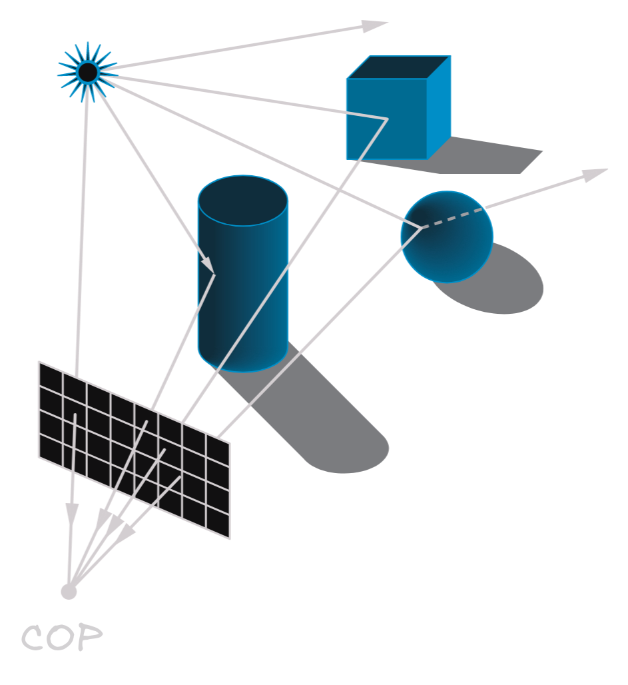
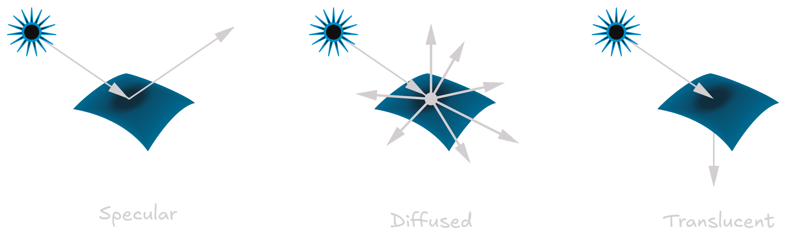
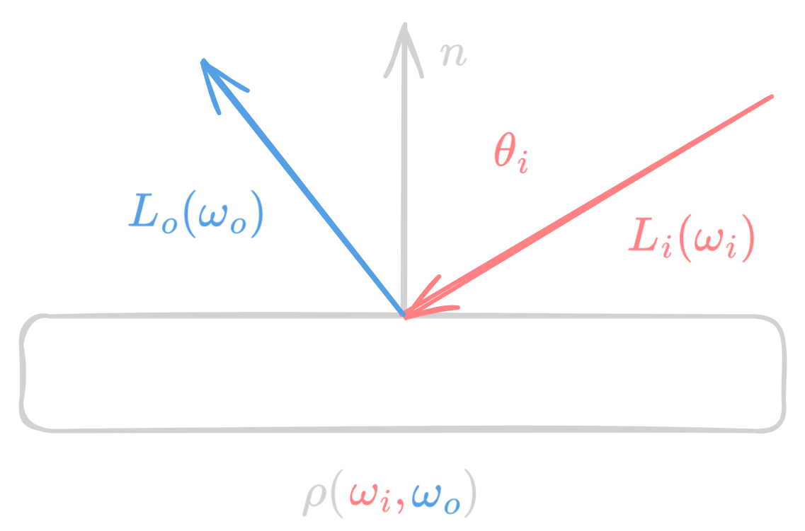

- A surface can emit light (self-emission) or reflect light from other sources.
- Recursive scattering of light between surfaces accounts for subtle shading effects. This can be expressed in the rendering equation.
- The rendering equation can either be physically based or empirical.
- Physically based rendering is very time consuming and expensive to compute, but it produces realistic images.

<figure markdown="span" >
  { width="400" }
  <figcaption>Lighting</figcaption>
</figure>

## Surface types based on light-matter interaction

- **Specular surfaces**: Shiny surfaces that reflect light in a narrow range of directions close to the angle of reflection.
- **Glossy surfaces**: Surfaces that are shiny but not as shiny as specular surfaces.
- **Diffuse surfaces**: Rough surfaces that reflect light in all directions.
- **Translucent surfaces**: Surfaces that allow light to pass through them.

<figure markdown="span">
  { width="700" }
  <figcaption>Surface Types</figcaption>
</figure>

## Physically Based Rendering a.k.a Global Illumination

### Some Terms

- **Flux** ($\Phi(A)$): The amount of light energy passing through a surface per unit time. Unit is watts.
- **Irradiance** ($E(A)$): Flux per unit area arriving at a surface. Unit is watts per square meter.
$$E(A) = \frac{d\Phi(A)}{dA(x)}$$
- **Radioisity** ($B(A)$): The total amount of light energy leaving a surface per unit time. Unit is watts.

<figure markdown="span">
  { width="500" }
</figure>

- **Radiance** ($L(\mathbf{x}, \vec{\omega})$): Flux density per unit solid angle, per perpendicular unit area

$$L(\mathbf{x}, \vec{\omega}) = \frac{d^2\Phi(A)}{d\vec{\omega}dA^\perp (x, \vec{\omega})}$$

- **Solid Angle** ($\Omega$): The angle subtended by a surface at a point in space. Unit is steradian.

$$\Omega = \frac{A}{r^2}$$

## Bidirectional Reflectance Distribution Function (BRDF)

- Ratio between outgoing radiance for angle $\omega_o$ and incoming irradiance for angle $\omega_i$.
- BRDF describes Density w.r.t $\omega_i$. Integrating it over all incoming irradiance gives the total outgoing radiance.

$$\rho(\omega_i, \omega_o) = \frac{d}{d \omega_i} \frac{L_o(\omega_o)}{L_i(\omega_i) \cos{\theta_i}}$$ 

<figure markdown="span">
  { width="500" }
  <figcaption>BRDF</figcaption>
</figure>

<figure markdown="span">
  { width="700" }
  <figcaption>BRDF for different surfaces</figcaption>
</figure>

### Properties of BRDF

- **Positivity**: $\rho(\omega_i, \omega_o) \geq 0$
- **Reciprocity**: $\rho(\omega_i, \omega_o) = \rho(\omega_o, \omega_i)$
- **Energy Conservation**: 

$$\forall \omega_i: \int_{\Omega} \rho(\omega_i, \omega_o) d\omega_o \leq 1$$

## The rendering equation

$$L_o(\mathbf{x}, \vec{\omega_o}) = E_o(\mathbf{x}, \vec{\omega_o}) + \int_{\Omega} \rho(\mathbf{x}, \vec{\omega_i}, \vec{\omega_o}) L_i(\mathbf{x}, \vec{\omega_i}) \cos{\theta_i} d\omega_i$$

This is too complicated to understand, so we will reduce it to a simpler form.

- Unknown function $L$ is related to linear operator (integration) on itself + emission function $E$.
- Discrete
    - Functions $\rightarrow$ Vectors, Linear operators $\rightarrow$ Matrices
    - $L = E + K \cdot L$
    - Linear system of equations
- Rendering becomes solving a linear system of equations. 

$$
\begin{align*}
L &= E + K \cdot L \\
L &= (I - K)^{-1} \cdot E \\
&= \sum_{i=0}^{\infty} K^i \cdot E
\end{align*}
$$

The last line is formed by the Neumann series expansion of $(I - K)^{-1}$.

## Light Paths

- Heckbert's notation for light paths:
- Expresses light paths in terms of surface interactions
- $L$ - Light source
- $E$ - Eye
- $S$ - Specular reflection/refraction
- $D$ - Diffused reflection

We can represent light paths as a regular expression

- `*` - Zero or more occurrences
- `+` - One or more occurrences
- `?` - Zero or one occurrence
- `|` - OR

Heckbert's classification of light paths:

- Direct illumination: $L(D|S)E$
- Indirect illumination: $L(D|S)D(D|S)+E$
- Classical (Whitted) ray tracing: $LDS*E$
- Full gloabl illumination: $L(D|S)*E$

## Approximate models

### Phong Reflection Model
- Blinn-Phong reflection model is a simplified model that approximates the shading of a surface.
- Efficient to compute and provides good results.
- Consists of three components: ambient, diffuse, and specular reflection.

$$I = I_a + I_d + I_s$$

<figure markdown="span">
  { width="500" }
  <figcaption>Phong Model</figcaption>
</figure>

#### Ambient Reflection
- Any point whose normal is not facing the light source will appear black.
- In reality, light bounces off other surfaces and illuminates the point.
- An ambient term is added to account for this.

$$I_a = k_a \cdot I_{a}, \text{ where } 0 \leq k_a \leq 1 $$

#### Diffuse Reflection

- Lambertian objects reflect light equally in all directions.
- No change in color with respect to the angle of view.
- Lambert's cosine law: intensity is proportional to the cosine of the angle between the light source and the normal. If $l$ is the light vector (pointing towards the light source) and $n$ is the normal vector, then the intensity $c$ is given by:

$$c \propto n \cdot l$$

