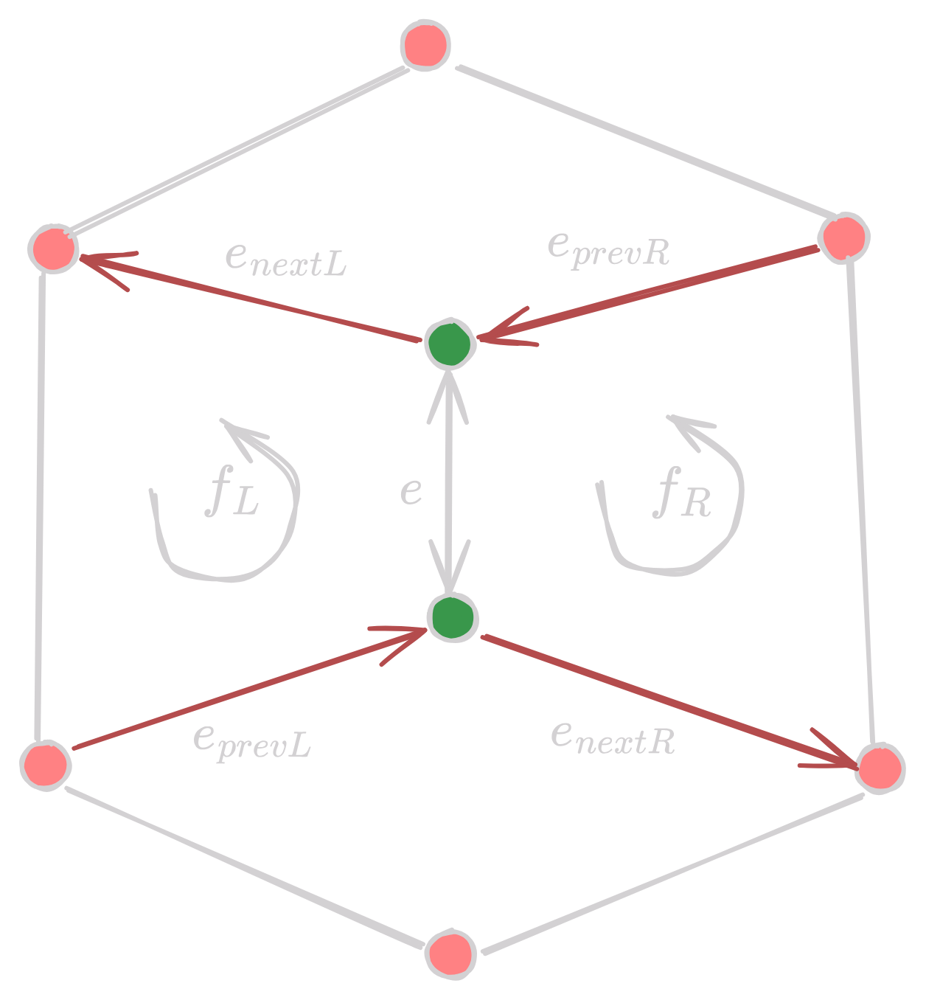
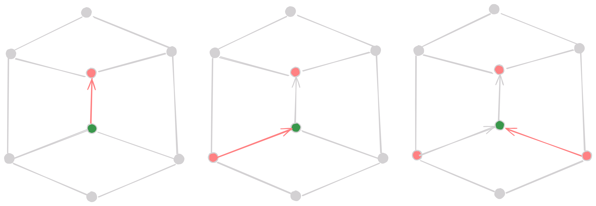

## Introduction to Mesh and it's properties

Piecewise linear approximation with error $O(h^2)$ is called a mesh

<figure markdown="span">
  { width="300"}
</figure>

Mesh elements

- Face: Subset of a 3d plane
- Edge: Incident points of 2 or more faces
- Vertex: Incident points of 2 or more edges

Mesh Local Structure

- ==Element type==: Triangle, Quad meshes, or polygon meshes. We always use triangles as they are always planar.
- ==Element shape==: Isotropic, i.e. locally uniform in all directions, or anisotropic, i.e. non-uniform in all directions.
- ==Element density==: Uniform or non-uniform. Non-uniform density is used to refine the mesh in regions of interest.

!!! note
    For better illustrations, see lecture slides on google classroom. I might add some illustrations here in the future myself but for now, I will just leave it as it is.

Regularity of Mesh

- Irregular: any number of irregular vertices
- Semi-regular: small number of irregular vertices
- Highly regular: most vertices are regular
- Regular: all vertices are regular

!!! info
    A Vertex is regular if it is incident to 6 edges. We generally use regular meshes as they are easier to work with.

## Mesh Data Structures

### Face Set

It is simply a list of faces. Each face is represented by a list of vertices.

| Faces                            |
| -------------------------------- |
| $f_1 = (v_{11}, v_{12}, v_{13})$ |
| $f_2 = (v_{21}, v_{22}, v_{23})$ |
| $\vdots$         |
| $f_n = (v_{n1}, v_{n2}, v_{n3})$ |

| Face                           |
| ------------------------------ |
| Vertex $v_1 = (x_1, y_1, z_1)$ |
| Vertex $v_2 = (x_2, y_2, z_2)$ |
| Vertex $v_3 = (x_3, y_3, z_3)$ |
|                |

<figure markdown="span">
  { width="600" }
  <figcaption>Face Set</figcaption>
</figure>

### Indexed Face Set

This time we are using indices to represent the vertices. This is useful when we have a large number of vertices and faces. This reduces redundancy and makes the data structure more compact.

| Face      |                 |
| --------- | --------------- |
| VertexRef | $v_1, v_2, v_3$ |
| FaceRef   | $f_1, f_2, f_3$ |
| FaceData  | data            |

| Vertex     |             |
| ---------- | ----------- |
| Point      | $(x, y, z)$ |
| FaceRef    | data        |
| VertexData | data        |

| Vertices                 |
| ------------------------ |
| $v_1 =  (x_1, y_1, z_1)$ |
| $v_2 =  (x_2, y_2, z_2)$ |
| $\vdots$                 |
| $v_n =  (x_n, y_n, z_n)$ |

| Faces                            |
| -------------------------------- |
| $f_1 = (i_{11}, i_{12}, i_{13})$ |
| $f_2 = (i_{21}, i_{22}, i_{23})$ |
| $\vdots$                         |
| $f_n = (i_{n1}, i_{n2}, i_{n3})$ |

<figure markdown="span">
  { width="500" }
<figcaption>Indexed Face Set</figcaption>
</figure>

### Winged Edge

This is a more complex data structure. Each Vertex and Face have a reference to an edge along with some other data. Each edge has the following

- Vertex references ($v_0$ being the source and $v_1$ being the target)
- Face references ($f_L$ and $f_R$)
- Previous and Next edge references for the left and right face
- Edge data

!!! warning  
    Edges in a face always follow anti-clockwise order.

| Vertex     |          |
| ---------- | -------- |
| Point      | position |
| EdgeRef    | edge     |
| VertexData | data     |

| Face     |      |
| -------- | ---- |
| EdgeRef  | edge |
| FaceData | data |

| Edge      |               |               |
| --------- | ------------- | ------------- |
| VertexRef | $v_0$         | $v_1$         |
| FaceRef   | $f_L$         | $f_R$         |
| EdgeRef   | $e_{{prevL}}$ | $e_{{prevR}}$ |
| EdgeRef   | $e_{{nextL}}$ | $e_{{nextR}}$ |
| EdgeData  | data          |

<figure markdown="span">
  { width="400" }
  <figcaption>Winged Edge</figcaption>
</figure>

#### One Ring Traversal in Winged Edge

- Start with a vertex
- Get one of its edges
- Add the other vertex of the edge to the one ring
- Set `curr_edge = ePrevL`
- Till `curr_edge->v0` is not equal to the first vertex in ring, add it
- Repeat for `ePrevR`

<figure markdown="span">
  { width="600" }
  <figcaption>One Ring Traversal in Winged Edge</figcaption>
</figure>

### Half Edge

Half edge is a more compact data structure. Each edge is split into two half edges. Each half edge has the following

- Vertex reference
- Face reference (always the one in anti-clockwise direction)
- Next half edge reference
- Previous half edge reference
- Twin half edge reference
- Half edge data

| Vertex      |          |
| ----------- | -------- |
| Point       | position |
| HalfEdgeRef | edge     |
| VertexData  | data     |

| Face        |      |
| ----------- | ---- |
| HalfEdgeRef | edge |
| FaceData    | data |

| Edge        |        |
| ----------- | ------ |
| VertexRef   | vertex |
| FaceRef     | face   |
| HalfEdgeRef | prev   |
| HalfEdgeRef | next   |
| HalfEdgeRef | twin   |
| EdgeData    | data   |

<figure markdown="span">
  { width="400" }
  <figcaption>Half Edge</figcaption>
</figure>

#### One Ring Traversal in Half Edge

- Start with a vertex
- Go to one of its half edges
- Switch to reverse edge (twin)
- Go to the next half edge (original vertex)
- Repeat until you repeat the original edge

<figure markdown="span">
  { width="600" }
  <figcaption>One Ring Traversal in Half Edge</figcaption>
</figure>

#### Boundary Traversal in Half Edge

- Start with a boundary edges
- Go to the next boundary edge
- Switch to the reverse edge (twin)
- Repeat until you reach the original edge

<figure markdown="span">
  { width="600" }
  <figcaption>Boundary Traversal in Half Edge</figcaption>
</figure>

??? info "Directed Edge"
    Half edge modification for triangular meshes.

    - Store all 3 half-edges of common face next to each other in memory.
    - Let $f$ be the index of the same face. Place it's $k$th $(0,1,2)$ half-edge at index $3f+k$ in the array.
    - Then $h$th half-edge belongs to $f$th face = $h / 3$
    - Index of $h$th half-edge in the array = $h mod 3$
    - No need to store face-to-edge and face-to-edge references.

### Performance Comparison of Mesh Data Structures

??? important "One Ring, Two Ring, and k-Ring" 
    - One Ring: All vertices connected to a vertex by an edge. 
    - Two Ring: Vertex connected to a vertex in the one ring. 
    - k-Ring: All vertices connected to a vertex by an edge or a vertex connected to a vertex in the k-1 ring.

    Roughly speaking, the one ring is the immediate neighbors of a vertex, the two ring is the neighbors of the neighbors, and so on.

| Data Structure   | Space per Vertex | Mesh Topology                                  | Rendering     | One-Ring Traversal       | Boundary Traversal |
| ---------------- | ---------------- | ---------------------------------------------- | ------------- | ------------------------ | ------------------ |
| Face Set         | 72 bytes         | Static, fixed (3,4)                            | Fast          | Slow                     | Slow               |
| Indexed Face Set | 36 bytes         | Static, fixed (3,4)                            | Fast          | Slow                     | Slow               |
| Winged Edge      | 120 bytes        | Any (2 manifolds)                              | Medium        | Slow (case distinctions) | Slow               |
| Half Edge        | 144 / 96 bytes   | Any (2 manifolds)                              | Medium / Slow | Fast                     | Fast               |
| Directed Edge    | 64 bytes         | Regular Triangular / Quad Meshes (2 manifolds) | Medium/Slow   | Medium                   | Medium             |

### Pros and Cons of Mesh Data Structures

| Data Structure   | Pros                                                   | Cons                                                                    |
| ---------------- | ------------------------------------------------------ | ----------------------------------------------------------------------- |
| Face Set         | Static meshes; rendering                               | No explicit connectivity information; data redundancy                   |
| Indexed Face Set | Simple and efficient storage; Static meshes; rendering | No explicit connectivity information; Not efficient for most algorithms |
| Winged Edge      | Arbitrary Polygonal Meshes                             | Massive cse distinctions for one-ring traversal                         |
| Half Edge        | One-ring traversal; explicit representation of edges   | Slow rendering                                                          |

### Applications of Mesh Data Structures

| Data Structure   | Applications                           |
| ---------------- | -------------------------------------- |
| Face Set         | Stereolithography (3D printing)        |
| Indexed Face Set | Rendering                              |
| Winged Edge      | Rarely used                            |
| Half Edge        | Mesh refinement, decimation, smoothing |
