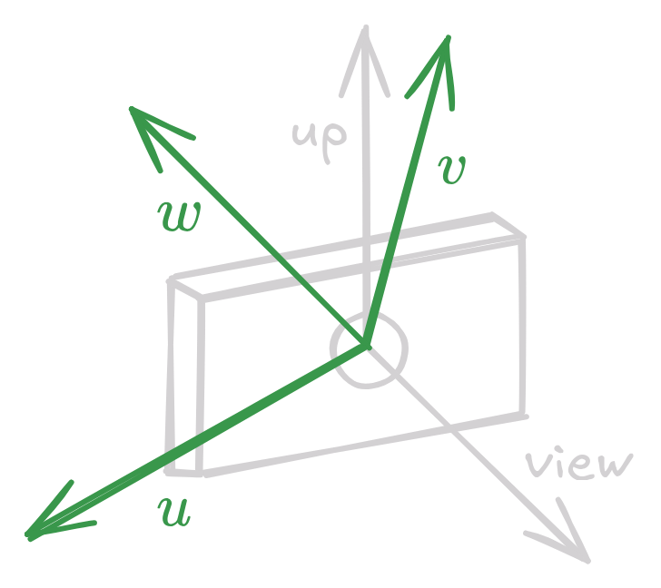
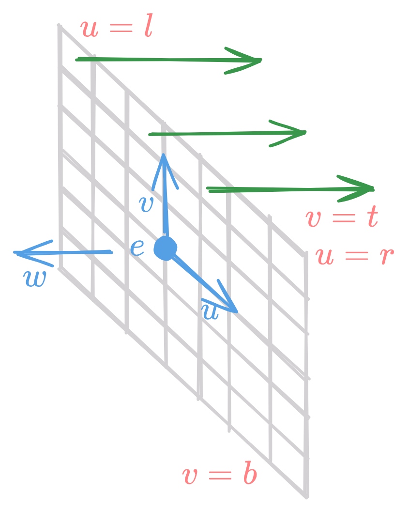
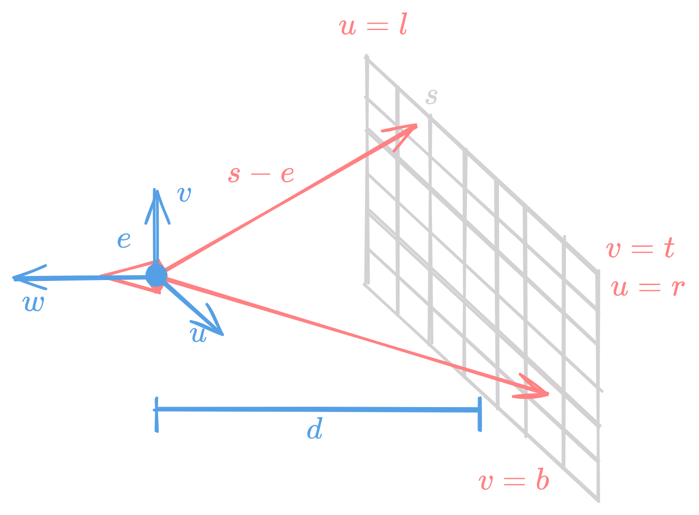
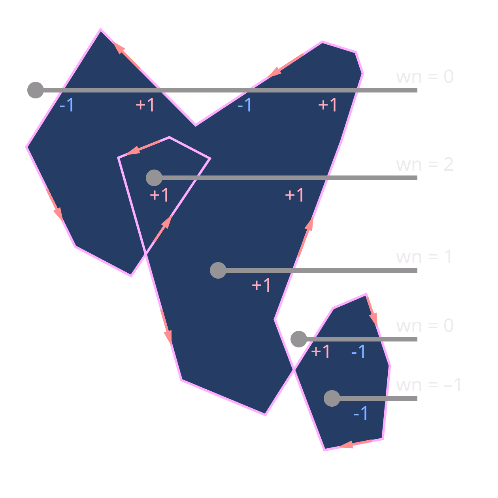

Rendering is a process that takes as inputs a set of objects and produces an array of pixels. It can be organized in 2 ways

- Object-order rendering: Where the objects are processed one by one
- Image-order rendering: Where the pixels are processed one by one

Ray tracing is an image-order algorithm

## Basic Algorithm
A basic ray tracer consists of three parts 

- ^^Ray generation^^ : Computes origin and direction of each pixel's viewing ray based on camera geometry
- ^^Ray intersection^^ : Finds the intersection of the viewing ray with the scene geometry
- ^^Lighting^^ : Computes the color of the pixel based on the result of ray-object intersection

```
for each pixel in the image:
    compute viewing ray
    find first object hit by the ray and its surface normal n
    shade the pixel using hit-point, light and n
```

## Ray Generation or Computing Viewing Ray
- basic tools for ray generation are the viewpoint and the image plane
- Ray representation $p(t) = e + t (s - e)$, where $e$ is eye and $s$ is a point on the image plane
- Point $e$ is ray's origin and (s - e) is ray's direction

<figure markdown="span">
   { width="400" } 
  <figcaption>Ray Generation</figcaption>
</figure>

- Ray generation takes place from the camera frame
- position $e$ (eye point)
- $\mathbf{u},  \mathbf{v},  \mathbf{w}$ are basis vectors
- Choose $-w$ as view direction and an up vector, using which we construct the basis vectors

<figure markdown="span">
    { width="400" }
    <figcaption>Camera Vectors</figcaption>
</figure>

### Orthographic Views

- All rays will have direction $- \mathbf{w}$
- A viewpoint is not require but viewing rays can start from the plane containing the camera, so we know when object is behind the camera.
- Viewing rays start on the image plane and are parallel to each other, and cab be defined by point $e$ and vectors $ \mathbf{u}$ and $ \mathbf{v}$

<figure markdown="span">
    { width="300" }
    <figcaption>Orthographic Rays</figcaption>
</figure>

- $l$ and $r$ are left and right limits of the image plane (measured along $\mathbf{u} $) $l < 0 < r$
- $b$ and $t$ are bottom and top limits of the image plane (measured along $ \mathbf{v}$) $b < 0 < t$

Pixel spacing for $n_x \times n_y$ image is

- Horizontal : $\Large \frac{r - l}{n_x}$
- Vertical : $\Large \frac{t - b}{n_y}$

Therefore, pixel position $(i, j)$ in the raster image is 

- $u = l + \Large \frac{(r - l)(i + 0.5)}{n_x}$
- $v = b + \Large \frac{(t - b)(j + 0.5)}{n_y}$

Where $u, v$ are the coordinates of the pixel in the image plane w.r.t origin $e$ and basis vectors $\mathbf{u} ,  \mathbf{v}$

Therefore, Ray parameters are 
- Origin: $e + u * \mathbf{u} + v * \mathbf{v}$
- Direction : $- \mathbf{w}$

### Perspective Views

- All rays will have different directions for different pixels
- All rays will have origin at the eye point

<figure markdown="span">
    { width="500" }
    <figcaption>Perspective Rays</figcaption>
</figure>

- Image plane positioned at distance $d$ from the eye point $e$
- Ray parameters are 
    - Origin: $e$
    - Direction: $-d * \mathbf{w} + u * \mathbf{u} + v * \mathbf{v}$

Where $u, v$ are the coordinates of the pixel in the image plane w.r.t origin $e$ and basis vectors $\mathbf{u} ,  \mathbf{v}$  

!!! note 
    In some sense, the origin in orthographic view is direction in perspective view.


## Ray intersection

- Given a generated ray $p(t) = e + t \cdot d$, find intersection (first hit) with the scene geometry such that $t > 0$
- Given a ray $p(t) = e + t \cdot d$, and an implcit surface $f(p) = 0$, the intersection point is found by solving $f(e + t \cdot d) = 0$ 
- There can be multiple solutions for $t$, but we are interested in the smallest positive solution

### For Sphere

- Parametric equation for any point $p$ on a sphere with center $c$ and radius $r$ is 

$$ (p - c) \cdot (p - c) - r^2 = 0 $$

- For finding points of intersection of a ray with a sphere, we substitute $p = e + t \cdot d$ in the above equation and solve for $t$

$$
\begin{align*}
    (e + t \cdot d - c) \cdot (e + t \cdot d - c) - r^2 &= 0 \\
    (d \cdot d) t^2 + 2 (d \cdot (e - c)) t + (e - c) \cdot (e - c) - r^2 &= 0
\end{align*}
$$

This gives the solution

$$t = \frac {-(d \cdot (e - c)) \pm \sqrt{(d \cdot (e - c))^2 - (d \cdot d) ((e - c) \cdot (e - c) - r^2)}}{d \cdot d}$$

#### Normal for Sphere
- The normal vector at $\mathbf{p}$ on the implicit surface $f(p)$ is given by 

$$n = \nabla f(p) = (\frac{\partial f(p)}{\partial x}, \frac{\partial f(p)}{\partial y}, \frac{\partial f(p)}{\partial z})$$


- For sphere, the normal at point $p$ is

$$n = 2(p - c) \hspace{20px} \text{and} \hspace{20px} \hat{n} = \frac{p - c}{R}$$


### For Triangle 

- Parametric equation for a triangle is

$$ \mathbf{e} + t \mathbf{d} = \mathbf{f}(u, v)$$ 

- 3 unknowns $t, u, v$ and 3 equations $(x, y, z)$ for the triangle. We can solve for $t, u, v$ and check if $u, v$ are within the range of the triangle.

- For a parametric plane, the parametric surface can be represented in terms of any three points in the plane. Utilize barycentric coordinates for ray-triangle test 

- For a triangle with vertices $\mathbf{a},  \mathbf{b}, \mathbf{c}$ intersection will occur when 

$$\mathbf{e} + \mathbf{d} t = \mathbf{a} + \beta (\mathbf{b} - \mathbf{a}) + \gamma (\mathbf{c} - \mathbf{a})$$ 

- Intersection is inside the triangle if $\beta, \gamma \geq 0$ and $\beta + \gamma \leq 1$
- To solve for $t, \beta, \gamma$, we can write the above equation as

$$
\begin{align*}
    x_e + t x_d &= x_a + \beta (x_b - x_a) + \gamma (x_c - x_a) \\
    y_e + t y_d &= y_a + \beta (y_b - y_a) + \gamma (y_c - y_a) \\
    z_e + t z_d &= z_a + \beta (z_b - z_a) + \gamma (z_c - z_a)
\end{align*}
$$

This can be written in matrix form as

$$
\begin{bmatrix}
    x_a - x_b & x_a - x_c & x_d \\
    y_a - y_b & y_a - y_c & y_d \\
    z_a - z_b & z_a - z_c & z_d
\end{bmatrix}
\begin{bmatrix}
    \beta \\
    \gamma \\
    t
\end{bmatrix}
= 
\begin{bmatrix}
    x_a - x_e \\
    y_a - y_e \\
    z_a - z_e
\end{bmatrix}
$$

- Let $A$ be the matrix on the left, $B$ be the matrix on the right, then using Cramer's rule, we can solve for $\beta, \gamma, t$ as follows

- Let $A_i$ be the matrix obtained by replacing $i^{th}$ column of $A$ with the column of $B$, then values of $\beta, \gamma, t$ are

$$
\beta = \frac{\text{det}(A_1)}{\text{det}(A)} \hspace{20px} \gamma = \frac{\text{det}(A_2)}{\text{det}(A)} \hspace{20px} t = \frac{\text{det}(A_3)}{\text{det}(A)}
$$

### Ray-Polygon Intersection

Givem $m$ vertices $p_1, p_2, \ldots, p_m$ of a polygon and surface normal $n$
- Compute the intersection point between ray $\mathbf{e} + t \mathbf{d}$ and the plane containing the polygon $(p - p_1) \cdot n = 0$

$$t = \frac{(p_1 - e) \cdot n}{d \cdot n}$$

- If $\mathbf{p}$ is inside the polygon, then the ray hits it.

## Point-in-Polygon Test

### Ray Polygon Intersection or Crossing Number Algorithm

- Send a 2D ray out from $p$ and count the number of intersections between the ray and the polygon
- If the intersection count is odd, then $p$ is inside the polygon

!!! Warning
    It's a ray, so only one way

- Easily done by checking the sign of the cross product of the vectors from $p$ to the vertices of the polygon

<figure markdown="span">
    { width="400" }
    <figcaption>Crossing Number Algorithm</figcaption>
</figure>

### Winding Number Algorithm

- Winding number of a closed curve in the plane around a given point is an integer representing the total number of times that curve travels counterclockwise around the point
- If the winding number is non-zero, then the point is inside the polygon

<figure markdown="span">
    { width="400" }
    <figcaption>Winding Number Algorithm</figcaption>
</figure>

