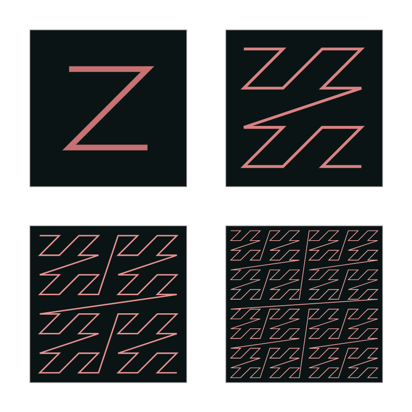

## Surface Representation
- Formally: Surface is a 2D manifold embedded in 3D space.
- Informally: Surface is boundary of a non-degenerate 3D solid.

A non-degenerate solid object is one where each point can be classified as either interior or exterior.

!!! info "What is a manifold?"
    An n-dimensional manifold will look like an n-dimensional Euclidean space when looked at closely. For example, if you zoom in infinitely on a hollow sphere, it will look like a 2D plane.

### Surface Classifications

| Classification | Examples |
|----------------|-------------|
| Orientable/Non Orientable | Torus is orientable, Klien Bottle is not| 
| Closed/Open | Sphere is closed, Plane is open |
| Manifold/Non-Manifold | Sphere is manifold, Cone is non-manifold |

### Topological Classification
- Topological Equivalence: Two surfaces are topologically equivalent if one can be deformed into the other without any cuts or gluing.
- Genus: Maximum Number of cuttings along non-intersecting closed curves that can be made without separating the surface.

### Operational Classification
- Evaluation: The sampling of the surface geometry or other surface properties.
- Modification: A surface can be changed in terms of geometry(deformations) or topology(cuts, gluing).
- Query: Spacial queries to determine if given point is inside or outside the solid bounded by the surface, or distance of point from the surface.

### Surface Representation
- Implicit Surfaces: Defined as the set of points satisfying an equation $f(x, y, z) = 0$.
- Parametric Surfaces: $S(u, v) = (x(u, v), y(u, v), z(u, v))$ where $S: \mathbb{R}^2 \rightarrow \mathbb{R}^3$.

## Volume Representation

### Uniform Grid

- Trivial 3D grid where each cell is a cube, and it stores certain data, like color, density, etc. Used in medical imaging, many GPU applications, etc.

Construction:

- Find the bounding box of the object.
- Define grid resolution (manual or automatic).
- Choose indexing and create huge arrays in memory
- For each cell, sample desired values and store them in cell
- Huge memory overhead!

!!! Success "Pros"
    - Trivial to implement
    - Very parallelizable
    - Trivial boolean operations

!!! Failure "Cons"
    - Huge memory overhead
    - large 3D loops make algorithms too slow

??? info "Z-Order Curve / Z Indexing"
    This is a traversal method for 3D grids, where the cells are traversed in a specific order, which provides better cache coherency and locality.

    <figure markdown="span">
        { width="600" }
      <figcaption>Z-Order Curve</figcaption>
    </figure>

### Octree
Adaptive grid structure where cells are recursively subdivided until a certain criterion is met. Each non-leaf node has 8 half-sized children. Used in Volume data storage, Color quantization, Collision detection, etc.

<figure markdown="span">
    { width="800" }
  <figcaption>Octree</figcaption>
</figure>

#### Data structure
- Node
    - `NodeType` type
    - `NodeRef subNodes[8]`
- NodeType
    - `EMPTY` - all children are empty
    - `MIXED` - atleast one non-empty subcell
    - `FULL` - all children are full

#### Construction
- Top down approach:
    - Fit whole data(geometry) into one bounding cell
    - If it is mixed $ \rightarrow $ subdivide into 8 children
    - Repeat recursively until there is nothing more to subdivide
- Bottom up approach:
    - Create uniform grid with high resolution
    - For each 8 neighbours do:
        - If all are empty, merge them
        - If all are full, merge them
        - Else, create mixed parent cell and continue

!!! Success "Pros"
    - Memory efficient
    - Fast boolean operations
    - Adaptive resolution

!!! Failure "Cons"
    - Longer point localization (data search)
    - Small changes in geometry can lead to large changes in tree
