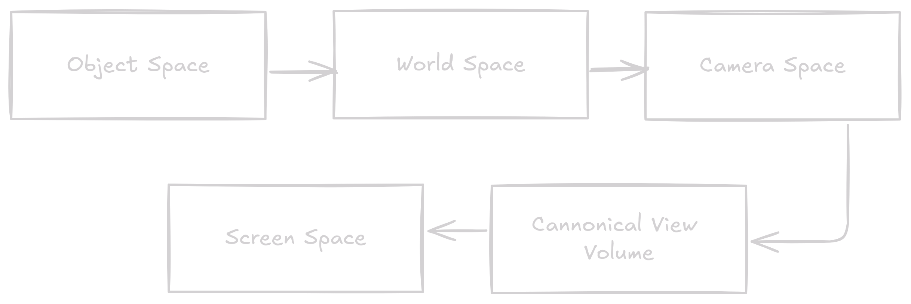
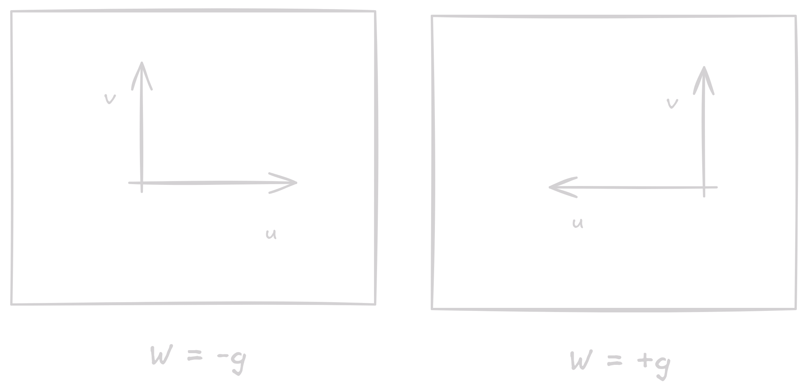

## Types of Projections

- Orthographic/Parallel: projection lines are all parallel to each other (direction of projection or DOP)
- Perspective: projection lines converge at a single point (center of projection or COP)

<figure markdown="span">
    { width="800" }
  <figcaption>Perspective vs Orthographic Projection</figcaption>
</figure>

!!! note
    There are many types of projections, but all of them can be classified into these two categories.

    There are many more subtypes of Parallel projection than Perspective projection.

## Parallel Projections

In the given figure, DOP is the direction of projection and VPN is view plane normal. Assume object face of interest lies in principal plane.

<figure markdown="span">
    { width="800" }
  <figcaption>Types of Parallel Projections</figcaption>
</figure>

| Type | Description | VPN $\parallel$ a principal axis? | DOP $\parallel$ VPN? |
|------|-------------|-----------------------------------|----------------------|
| Multiview Orthographic | Shows a single face, exact measurements | Yes | Yes |
| Axonometric | Adjacent faces, ==none exact==, uniformly foreshortened | No | Yes |
| Oblique | adjacent faces, ==one exact==, others uniformly foreshortened | Yes | No |

???+ note "What the hell is foreshortening?"
    Foreshortening is the visual effect or optical illusion that causes an object or distance to appear shorter than it actually is because it is angled toward the viewer.

### Multiview Orthographic Projections
- Projectors are orthogonal to the projection plane
- Projection plane is parallel to one of the principal planes
- Think of taking front view, top view, and side view of an object

### Axonometric Projections

<figure markdown="span">
    { width="800" }
    <figcaption>Different types of Axonometric Projections</figcaption>
</figure>

| Type | Description  |
|------|------------- |
| Isometric | All three principal axes equal ($120^\circ$) |
| Dimetric | Two principal axes are equal |
| Trimetric | All three principal axes are different |

> Skipping Oblique Projections for now.

## Perspective Projections

- Describes the way we see the world
- Parallel lines don't remain parallel post projection (Foreshortening is not uniform)
- ==View Point== is the point from which the object is viewed. It's an actual point
- ==Vanishing Points== are points where parallel lines converge. They are imaginary points.

<figure markdown="span">
    { width="800" }
    <figcaption>Perspective Projections</figcaption>
</figure>

| Type | Description |
|------|-------------|
| One-point Perspective | All parallel lines converge to a single point |
| Two-point Perspective | All parallel lines converge to one of two points |
| Three-point Perspective | All parallel lines converge to one of three points |

There can be more than three vanishing points as well, and that would be an N-point perspective.

## Viewing Transformations

Mapping 3D locations in the canonical coordinate system to coordinates in the image. Composed of:

- A camera transformation or eye transformation
- A projection transformation
- A viewport transformation or windowing transformation

!!! note
    Cannonical View Volume (CVV) is a cube containing all 3D points whose coordinates are in the range $[-1, 1]$.

!!! abstract "Viewing Frustum"
    The viewing frustum is the region of space in the world that is visible in the image. It is the region of space that is mapped to the CVV.

The pipeline is as follows

<figure markdown="span">
    { width="800" }
    <figcaption>Viewing Transformation Pipeline</figcaption>
</figure>

### ==Camera Transformation==

Positioning the camera to look in a particular direction

- The eye position $e$
- The gaze direction $g$
- The view-up vector $t$

The user specifies viewing as a tripled $(e, g, t)$, using which we create basis vectors $u, v, w$ as follows:

- $w = \frac{-g} {\lVert g \rVert }$
- $u = \frac{t \times w} {\lVert t \times w \rVert }$
- $v = w \times u$

Basic idea: Convert the camera to the origin and align the camera with the $z$-axis.

$$ M_{w \rightarrow c} = \begin{bmatrix} u & v & w & e \\  0 & 0 & 0 & 1 \end{bmatrix}^{-1} = \begin{bmatrix}
    x_u & x_v & x_w & 0 \\
    y_u & y_v & y_w & 0 \\
    z_u & z_v & z_w & 0 \\
    0 & 0 & 0 & 1
\end{bmatrix}  \begin{bmatrix}
    1 & 0 & 0 & -x_e \\
    0 & 1 & 0 & -y_e \\
    0 & 0 & 1 & -z_e \\
    0 & 0 & 0 & 1
\end{bmatrix} $$

$$ M_{c \rightarrow w} = \begin{bmatrix} u & v & w & e \\  0 & 0 & 0 & 1 \end{bmatrix} $$

??? question "Why is $w = -g$?"

    If we change the direction of $w$, the direction of $u$ changes, and it looks like we have flipped the camera.

    <figure markdown="span">
        { width="500" }
        <figcaption>How sign of $w$ affects $u, v$</figcaption>
    </figure>

### Projection Transformation

Project points from camera space to the canonical view volume.

#### Orthographic Projection

View Volume is a rectangular parallelepiped $[l, r] \times [b, t] \times [n, f]$. The steps are:

- Move the center of the view volume to the origin
- Scale the view volume to the canonical view volume

$$ M_{ortho_{t}} = \begin{bmatrix}
    1 & 0 & 0 & -\frac{l+r}{2} \\
    0 & 1 & 0 & -\frac{t+b}{2} \\
    0 & 0 & 1 & -\frac{n+f}{2} \\
\end{bmatrix} , \hspace{20px}
M_{ortho_{s}} = \begin{bmatrix}
    \frac{2}{r-l} & 0 & 0 & 0 \\
    0 & \frac{2}{t-b} & 0 & 0 \\
    0 & 0 & \frac{2}{f-n} & 0 \\
    0 & 0 & 0 & 1
\end{bmatrix}
$$

$$ M_{orth} = M_{ortho_s} \times M_{ortho_t} =  \begin{bmatrix}
    \frac{2}{r-l} & 0 & 0 & -\frac{r+l}{r-l} \\
    0 & \frac{2}{t-b} & 0 & -\frac{t+b}{t-b} \\
    0 & 0 & \frac{2}{f-n} & -\frac{f+n}{f-n} \\
    0 & 0 & 0 & 1
\end{bmatrix} $$

#### Perspective Projection

View Volume is a frustum with the apex at the origin. Perspective projection is not affine, so we need to use homogeneous coordinates.

- $d$ is the distance from the eye to the image plane
- $x_s = \frac{d}{z} x$
- $y_s = \frac{d}{z} y$

The perspective projection matrix, for a frustum with $n$ and $f$ as near and far planes, is:

$$ M_{persp} = \begin{bmatrix}
    n & 0 & 0 & 0 \\
    0 & n & 0 & 0 \\
    0 & 0 & n+f & -fn \\
    0 & 0 & 1 & 0
\end{bmatrix} $$

$$ \begin{pmatrix}
    x \\ y \\ z \\ 1
\end{pmatrix}
 \rightarrow 
 \begin{pmatrix}
    nx \\ ny \\ (n + f)z - fn \\ z
 \end{pmatrix}
\rightarrow
\begin{pmatrix}
    \frac{n}{z} nx \\ \frac{n}{z} ny \\ (n + f - fn) \\ z
\end{pmatrix}
$$

!!! question "What is going on in the 3rd row and 4th row?"
    - We use one in the 4th row to introduce $w = z$, which we would divide by later. to get $\frac{d}{z} x$ and $\frac{d}{z} y$. 
    - The 3rd row is to maintain the $z$ value. We need to maintain the $z$ value to calculate the depth of the object. We only care about the relative ordering so, we get 
  
    $$\tilde{z}(t) = n + f - \frac{nf}{t}$$

    Where $t$ is the $z$ value of the object in the camera space. Notice that $\tilde{z}(n) = n$ and $\tilde{z}(f) = f$.

#### Full Perspective Transformation

$$ M_{persp} = M_{orth} \times M_{persp} $$

$$ M_{persp} = \begin{bmatrix}
    \frac{2n}{r-l} & 0 & \frac{r+l}{r-l} & 0 \\
    0 & \frac{2n}{t-b} & \frac{t+b}{t-b} & 0 \\
    0 & 0 & \frac{f+n}{f-n} & -\frac{2fn}{f-n} \\
    0 & 0 & 1 & 0
\end{bmatrix} $$

### Viewport Transformation

Map the canonical view volume to the screen coordinates. Image boundaries have a half-unit offset. We want to map $[-1, 1]^2$ to $[-0.5, n_x - 0.5] \times [-0.5, n_y - 0.5]$

The transformation to map points in $[x_l, x_h] \times [y_l, y_h]$ to $[x_l', x_h'] \times [y_l', y_h']$ is called Windowing Transformation. The steps are:

- Move $[x_l, y_l]$ to $[0, 0]$
- Scale the rectangle to the target rectangle
- Move the rectangle to $[x_l', y_l']$

$$ M_{win} = \begin{bmatrix}
    1 & 0 & x_l' \\
    0 & 1 & y_l' \\
    0 & 0 & 1
\end{bmatrix} \begin{bmatrix}
    \frac{x_h' - x_l'}{x_h - x_l} & 0 & 0 \\
    0 & \frac{y_h' - y_l'}{y_h - y_l} & 0 \\
    0 & 0 & 1
\end{bmatrix} \begin{bmatrix}
    1 & 0 & -x_l \\
    0 & 1 & -y_l \\
    0 & 0 & 1
\end{bmatrix} $$

For the screen coordinates, we have $[0, n_x] \times [0, n_y]$, so $x_l = 0, x_h = n_x, y_l = 0, y_h = n_y$.

$$ M_{vp} = \begin{bmatrix}
    \frac{n_x}{2} & 0 & 0 & \frac{n_x - 1}{2} \\
    0 & \frac{n_y}{2} & 0 & \frac{n_y - 1}{2} \\
    0 & 0 & 1 & 0 \\
    0 & 0 & 0 & 1
\end{bmatrix} $$

!!! note
    The $z$-coordinate is preserved after the viewport transformation, as it will be used for depth testing.
